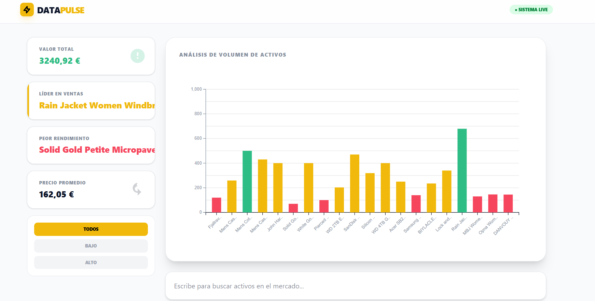
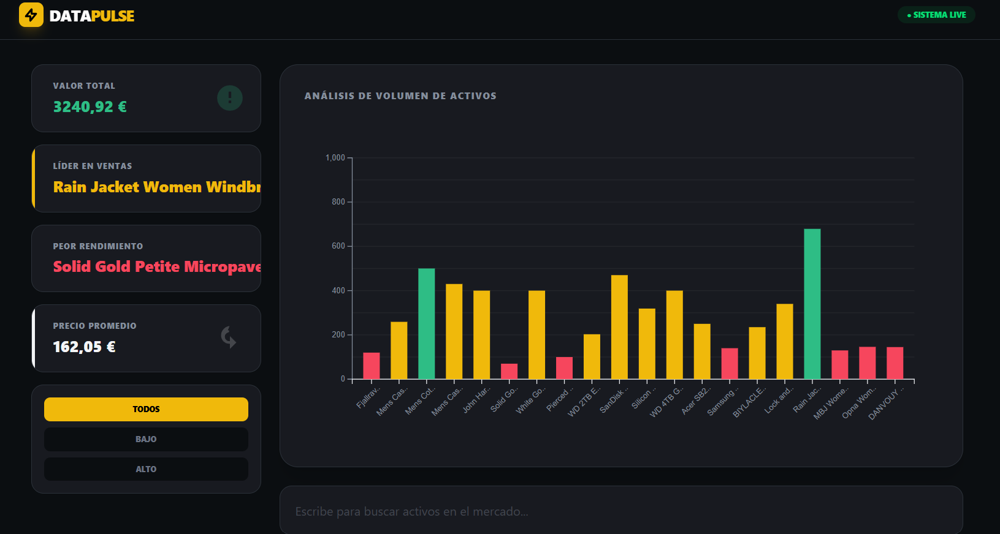
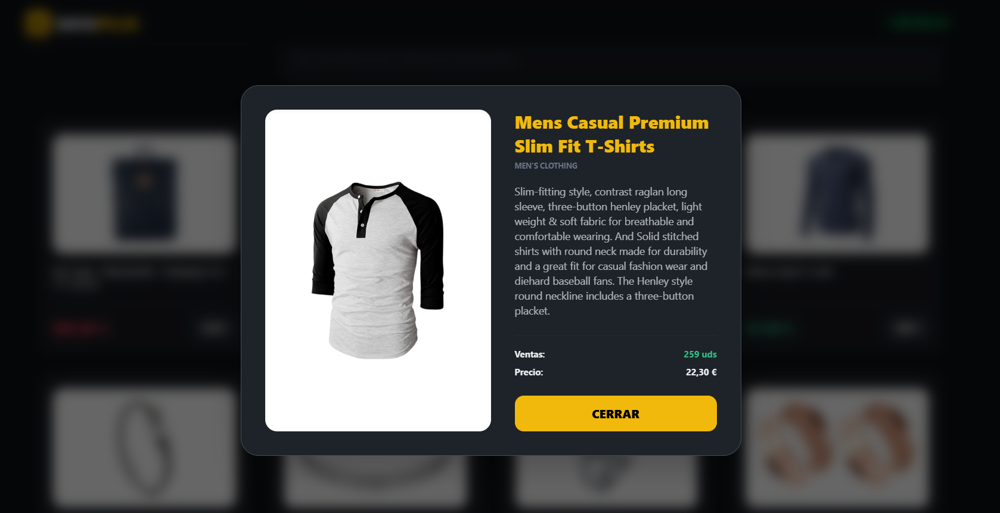
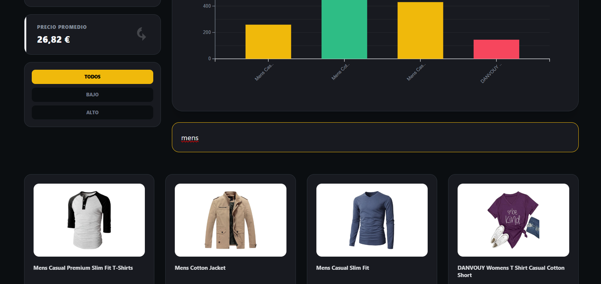

# 🚀 DataPulse Dashboard

**DataPulse** es un dashboard interactivo de análisis de mercado desarrollado con **React**, **TypeScript** y **D3.js**. El proyecto visualiza datos dinámicos de una API de productos, ofreciendo una experiencia de usuario premium inspirada en plataformas fintech como Binance.

🔗 **Link del Proyecto:** [https://data-pulse-ivory.vercel.app/](https://data-pulse-ivory.vercel.app/)

---

## 📸 Capturas de Pantalla

| Vista General (Dark Mode)           | Análisis de Datos                   |
| ----------------------------------- | ----------------------------------- |
|  |  |

| Filtrado Inteligente         | Detalle de Producto                |
| ---------------------------- | ---------------------------------- |
|  |  |

---

## ✨ Características Principales

- 📊 **Visualización de Datos Dinámica**: Gráficos de barras interactivos creados con **D3.js** que responden a filtros en tiempo real.
- 🌓 **Modo Oscuro Automático**: Interfaz inteligente que detecta la preferencia del sistema del usuario (Light/Dark mode) sin necesidad de interruptores manuales.
- 💀 **Skeletons de Carga**: Experiencia de usuario fluida con estados de carga animados (0.5s) para una transición suave de datos.
- 🔍 **Buscador Inteligente**: Filtrado instantáneo por nombre de activo o categoría con retroalimentación visual.
- 🏷️ **Segmentación por Precio**: Filtros rápidos para clasificar activos por rangos de precio (Bajo/Alto).
- 📱 **Diseño Responsive**: Estética moderna basada en **Tailwind CSS**, optimizada para cualquier dispositivo.

## 🛠️ Stack Tecnológico

- **Frontend**: React 18 + Vite
- **Lenguaje**: TypeScript (Tipado estricto)
- **Gráficos**: D3.js
- **Estilos**: Tailwind CSS
- **Hosting**: Vercel

## 🚀 Instalación Local

1. **Clonar el repositorio**
   ```bash
   git clone [https://github.com/TU_USUARIO/datapulse.git](https://github.com/TU_USUARIO/datapulse.git)
   ```

👤 Desarrollado por Christiam Silva con ♥️
